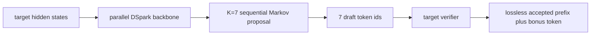

# MRV2 原生 DSpark FULL graph 与动态置信调度设计

## 1. 目标与结论

这次改造分成两个必须按顺序验收的阶段：

1. 先用 MRV2 原生 DSpark、固定 `K=7`、`FULL_DECODE_ONLY` 建立不包含置信调度和在线训练的干净性能基线。
2. 在相同 MRV2、相同最大 `K=7`、相同 FULL graph 上增加与 greedy proposal 对齐的置信头，并只在图外动态裁剪 target verifier 的验证前缀。

这样拆分的原因不是保守，而是为了让性能归因成立。若同时切换 model runner、proposer、图模式、动态 K、在线训练和热发布，任何一次变慢都无法定位到单一变量。

当前实现的关键边界是：动态模式仍生成完整的 7 个 draft token，节省的是 target verifier 的 token 数，而不是 drafter 的 backbone/Markov 计算。因此动态模式能否超过固定模式，取决于“减少的 target 验证成本”是否大于“confidence head、图外调度、同步调度器”的新增成本。

## 2. 为什么先切 MRV2 原生 DSpark

### 2.1 MRV1 历史路径的问题

旧的 Ascend 集成同时存在两套概念：

- 静态 DSpark 在部分 MRV1 组合中被映射成 `method=dflash` 兼容路径；
- 动态置信调度则要求 `method=dspark`，并走 MRV1 的动态 proposer。

这会导致静态与动态实验不仅 K 不同，连 proposer 和图执行路径也不同。此前观察到的“动态接受长度正常但速度变慢”，不能只归因于置信头；MRV1 原生 DSpark 的 eager 执行、逐步 Python Markov 链和调度同步都可能放大开销。

### 2.2 MRV2 的原生执行结构

MRV2 已经有原生 DSpark speculator。它将固定形状的 draft 阶段纳入 FULL graph：



DSpark 的主体不是 7 次完整自回归小模型前向，而是：

1. 用 target 的辅助 hidden states 和固定 query block 做一次并行 drafter backbone 前向；
2. 对 K 个位置得到基础 logits；
3. 用轻量 Markov head 按顺序注入前序 draft token 依赖；
4. target 一次验证 draft prefix，并在第一个不一致处截断。

FULL graph 的价值在于固定张量形状、消除逐步 Python/launch 开销，并复用已经捕获的 backbone 与 Markov 执行图。固定 K=7 是这条路径最干净的性能上界。

### 2.3 SpeCo 的 method 选择必须区分 MRV1 与 MRV2

本次修改不再把所有 Ascend DSpark 无条件映射成 DFlash：

- `VLLM_USE_V2_MODEL_RUNNER=0`：保留 MRV1 历史 `dflash` alias，避免破坏旧部署；
- `VLLM_USE_V2_MODEL_RUNNER=1`：保持原生 `method=dspark`，禁止安装 legacy DFlash registry alias。

这是一项语义修复。MRV2 已有原生 Markov DSpark 模型，继续 alias 到 DFlash 会静默丢掉模型与 proposer 的真实合同。

## 3. 固定 K=7 基线如何做到“干净”

脚本提供四个互斥模式。训练和消费置信头被故意拆开，因为旧
`rejection_sampling_overlap` 权重不能靠改一个配置字段变成 greedy 对齐权重：

| 模式 | 最大 K | 动态置信 | async scheduling | 在线 drafter 训练 | 用途 |
|---|---:|---:|---:|---:|---|
| `mrv2_fixed` | 7 | 关闭 | 自动启用 | 关闭 | 生产性能上界 |
| `mrv2_fixed_sync` | 7 | 关闭 | 强制关闭 | 关闭 | 动态模式的同步因果对照 |
| `mrv2_greedy_train` | 7 | 关闭 | 强制关闭 | 强制开启 | 在 fixed-K 下训练并保存新语义置信头 |
| `mrv2_dynamic` | 7 | 开启 | 强制关闭 | 默认关闭 | 只消费已校准 greedy 置信头的动态 A/B |

固定模式还会：

- 直接加载发布版 drafter checkpoint，不创建 confidence bootstrap；
- 完全不注入 `dynamic_spec_config`；
- 关闭 hidden-state 训练数据收集和在线热发布；
- 默认关闭 `val_before_train`，并将验证频率移出短性能窗口；
- 保持 `method=dspark`、`enforce_eager=False` 和 `FULL_DECODE_ONLY`。

因此固定模式的 step 时间只包含正常 RL rollout/actor 流程和 MRV2 固定 K speculative decoding，不含置信训练与发布尖峰。

`mrv2_greedy_train` 仍然按固定 K=7 验证，所以输入 checkpoint 即使带旧语义
confidence head，也不会参与当轮 K 决策；它只作为参数初始化。trainer 将
`confidence_target_mode=greedy_proposal_probability` 写入新 checkpoint。
`mrv2_dynamic` 启动时在 SpeCo 和 vLLM-Ascend 两层检查该元数据，缺失、旧模式或
`dspark_draft_topk` 均直接失败。这样禁止了最危险的“旧头先调度十步、训练后才变正确”。

## 4. 为什么旧的 confidence target 不适合 greedy DSpark

令 target 分布为 `p`，draft 分布为 `q`。

### 4.1 旧目标的正确适用条件

旧实现使用：

```text
y_overlap = sum_v min(p(v), q(v)) = 1 - TV(p, q)
```

这个量是“proposal token 确实从 q 采样，并由标准 rejection sampler 验证”时，单 token 接受率对 proposal 随机性的期望。

### 4.2 当前 serving 的真实 proposal

Ascend DSpark 当前使用确定性 greedy proposal：

```text
d = argmax_v q(v)
```

并只把 draft token id 交给 verifier，没有传完整 `draft_probs`。vLLM rejection sampler 在该合同下把已选 token 的 draft 概率视为 1，所以该 token 的接受概率是：

```text
P(accept d) = min(1, p(d) / 1) = p(d)
```

因此与运行时一致的 confidence 监督应为：

```text
y_greedy = p(argmax q)
```

本次训练改为先对已经包含 Markov 修正的 `draft_probs` 取 argmax，再从 `target_probs` gather 同一 token 的概率，最后用 BCE 训练 confidence logit。

### 4.3 为什么要限制采样参数

训练侧当前拿到的是原始 target logits，不能完整重放每个请求在 serving 中的 logit processor。因此新目标只在以下合同下启用：

- `temperature=1`；
- `top_k=-1`；
- `top_p=1`；
- `repetition_penalty=1`；
- DSpark draft 采用 dense greedy，未配置 `dspark_draft_topk`。

任一条件不满足时直接报错。否则 `softmax(raw_target_logits)` 不等于 verifier 实际使用的 target 分布，继续训练会产生可运行但不可解释的置信度。

旧 checkpoint 默认保留 `rejection_sampling_overlap` 语义；只有脚本显式选择 `greedy_proposal_probability` 时才切换，避免无声明地改变历史实验。

这里必须区分“配置标签”和“参数语义”。把旧 checkpoint 的
`confidence_target_mode` 文本改成新值，不会改变已经学到的函数，属于虚假迁移。
正确过程只能是：在 fixed-K serving 下，用新 label 重新训练、保存新权重，再让动态
scheduler 消费。动态模式若继续在线训练，也会拒绝显式切回 legacy target，防止第一次
hot publish 后把正确 scheduler 污染成旧语义。

## 5. 动态 K 的数学原理

置信头对请求 `b` 的第 `i` 个 draft 位置输出条件接受率：

```text
a[b,i] = sigmoid(confidence_logit[b,i])
```

第 `i` 个 token 能被接受，前面的 token 也必须全部接受。因此 prefix survival 为：

```text
S[b,i] = product(j=0..i) a[b,j]
```

若给请求 `b` 验证 `k_b` 个 token，期望接受的 draft token 数近似为：

```text
E[accepted_b] = sum(i=0..k_b-1) S[b,i]
```

在全 batch 的验证 token 总预算固定、每个验证位置成本近似相同时，优先选择最大的 `S[b,i]`，等价于优先购买期望收益最大的边际 token。由于 survival 在每个请求内部单调不增，最终选择天然对应 prefix；实现只需要输出每个请求的 prefix 长度。

调度器分两层：

1. 每隔 `budget_update_interval` 个 decode step，根据 `S >= threshold` 的平均数量更新共享预算 `budget_k`；
2. 每个 step 在保证每个请求至少 `min_verify_tokens` 后，将剩余全局预算分配给 batch 中最大的 survival 项。

阈值方向必须按源码理解：

- 阈值升高，满足条件的 survival 位置减少，K 倾向变小；
- 阈值降低，满足条件的位置增加，K 倾向变大。

这与部分 PR 文案中的口头描述可能相反，调参应以公式和运行日志中的 K 变化为准。

## 6. 为什么 confidence 在图内、scheduler 在图外

本次 MRV2 端口保持最大 K=7 的固定图形状：


图内部分必须保持固定形状。实现复用每个 Markov proposal 真正使用的 predecessor embedding，并在 K 个位置完成后合并成一次 batched FP32 confidence projection。这样避免：

- 为 confidence 再做一次 Markov embedding lookup；
- 执行 K 次很小的 linear launch；
- confidence 输入和真实 proposal predecessor 错位。

`sigmoid -> cumprod -> global top-k` 留在图外，因为它包含数据依赖的预算更新和变长输出。强行放进固定图不仅复杂，还不能解决 scheduler 最终需要 CPU 侧 per-request 长度这一事实。

置信 logits 若出现 `NaN` 或正负无穷，继续做 `cumprod/top-k` 会得到不可解释的 K。
实现不会为此增加一次 host 同步，而是在 device 上记录异常标记，并对当批所有请求保守
回退到固定最大 K=7。target verifier 仍保证输出正确，同时避免坏置信度减少验证长度。

## 7. 为什么动态模式第一版必须关闭 async scheduling

同步 EngineCore 在每个 model step 后调用 `take_draft_token_ids()`，scheduler 可以在这个事务里拿到每个请求不同的 K。

async scheduling 会复用固定长度的 draft placeholder，并绕过这次同步的 per-request draft-length handoff。如果只计算 K 却没有可靠地传给 scheduler，系统会表现为“配置和 confidence 指标都有，但 verifier 仍按固定 K 工作”。这是最危险的静默失效。

因此当前实现明确：

- fixed 模式允许 async；
- fixed-sync 与 dynamic 强制 `async_scheduling=False`；
- dynamic 配置若被最终 engine kwargs 覆盖成 async，启动时失败；
- dynamic speculator 若仍看到 async，也会二次失败。

per-request K 与 structured-output draft ids 共用原有 copy stream 和 completion event。两份 payload 排队完成后只做一次 CPU synchronize，并使用严格的一写一读状态机阻止旧 K 被下一个 batch 复用。

未来若要让 dynamic 超过 async fixed 上界，需要为 async scheduler 设计原生的变长 draft 协议，而不是删除这个保护。

## 8. 在线热发布与 FULL graph 的安全性

FULL graph 捕获后会持有图内 Parameter storage 的地址。在线更新可以修改参数值，但不能静默替换 Parameter storage，否则 graph replay 可能继续读取旧地址。

SpeCo 的标准 loader 使用原位 `copy_`，原则上保持 Parameter identity 和 `data_ptr`。本次增加事务式 guard：

1. 发布前记录所有 draft Parameter 的 identity、`data_ptr`、shape、stride、dtype 和 device；
2. 加载新权重并刷新 fused KV metadata；
3. 发布 revision 前再次比较；
4. 任一图内 Parameter storage 改变就拒绝提交 revision，并保持 generation 暂停，要求重建 worker。

fused KV 辅助 buffer 可以重建并更换地址，因为它们在 FULL graph replay 之前的 context-KV eager precompute 中使用，不在 query FULL graph 内。不能为了保持其地址而跳过刷新，否则会把新 backbone 参数和旧 fused KV snapshot 混成一个 revision。

当前在线训练路径只允许非量化 drafter。量化或自定义 loader 可能重打包权重或持有额外派生缓存，需要单独证明图安全后才能放开。

## 9. 性能模型与收益条件

固定 K 的单步 speculative 成本可近似写成：

```text
T_fixed = T_draft_full(Kmax) + T_verify(Kmax + bonus) + T_runtime
```

动态模式为：

```text
T_dynamic = T_draft_full(Kmax)
          + T_confidence
          + T_schedule
          + T_K_D2H
          + T_verify(K_b + bonus)
          + T_runtime_sync
```

因此动态有收益的必要条件是：

```text
saved_target_verify_cost
  > confidence + schedule + K_D2H + async_to_sync_penalty
```

这解释了两个重要现象：

- 接受长度变长不等于吞吐一定变快；若 verifier K 没有减少，或 async 损失更大，吞吐仍会下降；
- 关闭 confidence head 只省很小的 head/scheduler 成本，不能修复 MRV1 eager 或错误 proposer 路径带来的大开销。

当前第一版 dynamic 不减少 drafter K，并且 TP rank 都会执行相同的轻量 scheduler 与
K 回传；只有 output rank 的结果最终进入 CPU scheduler。这保证了各 worker 状态机一致，
但带来冗余 device 计算和 host boundary，是必须通过 profile 量化的固定成本。若 target
verifier 在当前 batch/sequence 形态下不是主耗时，动态 K 的理论空间本来就小；应通过
A/B/T/C 实测决定是否继续做 async 变长协议、只在 output rank 调度并广播，或“真正减少
draft K”的下一阶段。

## 10. 正确的 A/B/T/C 验收顺序

### A：固定 K7、FULL、async auto

```bash
bash examples/dynamic/run_qwen3-8b_drafter_dsparktemp1_confidence_a3_16npu.sh
```

用途：MRV2 原生 DSpark 的生产性能上界。

### B：固定 K7、FULL、同步 scheduler

```bash
SPECO_DSPARK_RUNTIME_MODE=mrv2_fixed_sync \
bash examples/dynamic/run_qwen3-8b_drafter_dsparktemp1_confidence_a3_16npu.sh
```

用途：量化关闭 async 本身的代价。

### T：固定 K7 下训练 greedy-aligned confidence

```bash
SPECO_DSPARK_RUNTIME_MODE=mrv2_greedy_train \
bash examples/dynamic/run_qwen3-8b_drafter_dsparktemp1_confidence_a3_16npu.sh
```

用途：产生新的 greedy 语义 checkpoint。这个阶段不属于性能 A/B，因为它包含 hidden-state
收集、20 个内部 optimizer step 和 hot publish。输入旧头只作为初始化，保存出的 checkpoint
必须包含 `confidence_target_mode=greedy_proposal_probability`。

快速验证训练/发布闭环时可以显式设置：

```bash
SPECO_DSPARK_RUNTIME_MODE=mrv2_greedy_train \
SPECO_DRAFTER_TRAINING_INTERVAL=2 \
bash examples/dynamic/run_qwen3-8b_drafter_dsparktemp1_confidence_a3_16npu.sh
```

性能实验不建议使用 2-step cadence，因为每两步插入 20 个 drafter optimizer step 和一次热发布，会污染 RL step wall time。

### C：动态 K、FULL、同步 scheduler

```bash
SPECO_DSPARK_RUNTIME_MODE=mrv2_dynamic \
DRAFTER_SOURCE_PATH=/absolute/path/to/greedy-aligned-full-checkpoint \
bash examples/dynamic/run_qwen3-8b_drafter_dsparktemp1_confidence_a3_16npu.sh
```

用途：与 B 比较，隔离 confidence projection、动态预算和变短 target verify 的净收益。
`mrv2_dynamic` 默认不训练；必须把 `DRAFTER_SOURCE_PATH` 指向 T 阶段保存的、目录内直接
含有 `config.json` 和完整权重的 checkpoint。直接使用旧 block7 checkpoint 会按设计在
preflight 失败，而不是静默用错标签。

若 C 已经通过干净 A/B，再用下面的显式开关测试“动态调度 + 持续在线训练”闭环：

```bash
SPECO_DSPARK_RUNTIME_MODE=mrv2_dynamic \
SPECO_ENABLE_DRAFTER_TRAINING=1 \
DRAFTER_SOURCE_PATH=/absolute/path/to/greedy-aligned-full-checkpoint \
bash examples/dynamic/run_qwen3-8b_drafter_dsparktemp1_confidence_a3_16npu.sh
```

## 11. 必须采集的指标

只看 `mean_acceptance_length` 不足以判断实现正确。每组至少采集：

- 排除模型加载、graph capture、首轮 validation 后的稳态 generation time；
- generated tokens/s 与整个 RL step wall time；
- proposed draft tokens、accepted draft tokens、mean acceptance length；
- 每步 `budget_k`、每请求 K 分布、target 实际验证 token 总数；
- confidence target mean、prediction mean、MAE、prefix calibration；
- FULL graph 命中/回退次数；
- dynamic 的 K D2H 与 scheduler 时间；
- 在线发布 revision、发布暂停时间和前后 Parameter pointer guard；
- target-only 与 speculative 输出的逐 token 等价性。

性能判断顺序：

1. A 是否显著快于旧 MRV1 路径；
2. B-A 是 async 转同步的固定成本；
3. T 只验收 label、loss、checkpoint metadata 与发布闭环，不参与吞吐比较；
4. C-B 才是本次动态置信调度的净收益；
5. 若 C 快于 B 但慢于 A，说明动态验证有效，但 async 协议缺口吞掉了收益；
6. 若 C 不快于 B，先看 target 验证 token 是否真实下降，再查 confidence 校准、所有 TP rank
   的调度/D2H 和 graph bucket padding 开销。

## 12. 当前验证边界

当前本地环境已能做源码、配置和静态合同检查，但没有 Ascend NPU，也没有可导入的完整 vLLM/torch/pytest 测试环境。因此以下结论尚不能从本机声明：

- ACL graph 捕获与 replay 已在 A3 成功；
- NPU event 的重复 record 和单次 synchronize 已在真实 runtime 验证；
- TP=2 的所有 rank 产生完全一致的 K；
- 在线发布后 graph 与 eager 输出一致；
- dynamic 模式吞吐超过 fixed-sync 或 async fixed；
- 200 个 RL step 长稳运行通过。

这些项目必须用上面的 A/B/T/C 和逐 token 等价测试在 A3 验收。MRV2 dynamic 是
vLLM-Ascend 与 SpeCo 的成对改动；只更新 SpeCo、仍停留在基础 `e4a187f` 的
vLLM-Ascend 会因缺少 `DynamicDraftTokensHandler` 等接口而在 preflight 失败。当前实现选择
fail-closed，是为了让版本、置信语义或 graph storage 合同在启动或 revision commit 前暴露，
而不是以错误结果继续运行。
